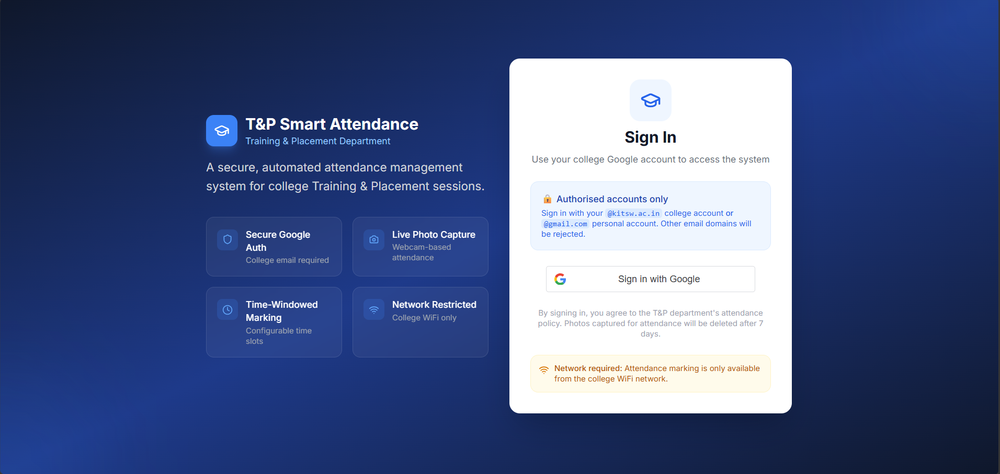

# 🎓 Smart Attendance Management System


A full-stack attendance management platform designed for college **Training & Placement (T&P)** sessions. The application provides secure Google authentication, webcam-based attendance verification, role-based dashboards, and an approval workflow to simplify attendance management while ensuring security and authenticity.

---

# 📌 Table of Contents

* Project Overview
* Features
* Technology Stack
* Architecture
* Screenshots
* Project Structure
* Installation & Setup
* Configuration
* API Documentation
* Security
* Deployment
* Future Enhancements
* Project Status
* Author
* License

---

# 🚀 Project Overview

Traditional attendance systems used during placement training sessions are often manual, time-consuming, and prone to proxy attendance.

The **Smart Attendance Management System** digitizes this process by allowing students to authenticate using Google OAuth, capture a live webcam photo, and submit attendance requests that are verified by administrators.

The platform provides:

* Secure Google Authentication
* JWT-based authorization
* Webcam attendance verification
* Admin approval workflow
* Attendance history
* Daily attendance status
* Configurable email-domain restrictions
* Automatic attendance photo cleanup

---

# ✨ Features

## 👨‍🎓 Student Features

* Sign in using Google OAuth
* Secure JWT authentication
* Capture live webcam photo
* Mark attendance
* View attendance history
* Check today's attendance status
* Responsive dashboard

---

## 👨‍💼 Admin Features

* Review attendance requests
* Approve or reject attendance
* View pending requests
* Daily attendance analytics
* Student management
* Attendance reports

---

## 🔐 Security Features

* Google OAuth authentication
* JWT authentication
* Role-Based Access Control (ADMIN / STUDENT)
* Configurable allowed email domains
* Secure backend token verification
* Automatic photo cleanup
* Environment variable configuration
* CORS configuration support

---

# 🛠 Technology Stack

| Layer          | Technology                   |
| -------------- | ---------------------------- |
| Frontend       | React 18, Vite, Tailwind CSS |
| Backend        | Spring Boot 3.2, Java 17     |
| Database       | MongoDB                      |
| Authentication | Google OAuth 2.0 + JWT       |
| Build Tools    | Maven, npm                   |
| Deployment     | Nginx + Spring Boot          |

---

# 🏗 Architecture

```text
               Google OAuth
                     │
                     ▼
          React Frontend (Vite)
                     │
             Google ID Token
                     │
                     ▼
         Spring Boot REST API
                     │
      Verify Google Authentication
                     │
                     ▼
          JWT Authentication
                     │
                     ▼
              MongoDB Database
                     │
                     ▼
      Attendance Photo Storage
```

---

# 📸 Screenshots

> Add screenshots after deployment.

```
screenshots/
│
├── login.png
├── student-dashboard.png
├── admin-dashboard.png
├── attendance-history.png
└── approval-page.png
```

Example:

```markdown
## Login



## Student Dashboard


## Admin Dashboard


```

---

# 📂 Project Structure

```text
smart-attendance/
│
├── backend/
│   ├── src/
│   │   └── main/
│   │       ├── java/com/tp/attendance/
│   │       └── resources/
│   │           └── application.yml
│   ├── uploads/
│   ├── pom.xml
│   └── .env.example
│
├── frontend/
│   ├── src/
│   ├── public/
│   ├── .env.example
│   └── package.json
│
└── README.md
```

---

# ⚙ Installation & Setup

## Prerequisites

* Java 17+
* Maven
* Node.js 18+
* MongoDB

---

## Clone Repository

```bash
git clone https://github.com/Abhilash1406/Smart.Attendance-Manager.git

cd Smart.Attendance-Manager
```

---

# Backend Setup

```bash
cd backend

mvn clean install

mvn spring-boot:run
```

Runs on

```
http://localhost:8080
```

---

# Frontend Setup

```bash
cd frontend

npm install

npm run dev
```

Runs on

```
http://localhost:5173
```

---

# ⚙ Configuration

## Backend

Configure

```
backend/src/main/resources/application.yml
```

Important values

```yaml
app:

  jwt:
    secret: ${JWT_SECRET:<your-base64-secret>}
    expiration: ${JWT_EXPIRATION_MS:86400000}

  google:
    client-id: ${GOOGLE_CLIENT_ID:<your-client-id>}

  allowed-domains:
    ${ALLOWED_EMAIL_DOMAINS:kitsw.ac.in,gmail.com}

  cors:
    allowed-origins:
      ${CORS_ALLOWED_ORIGINS:http://localhost:5173}
```

---

## Frontend

```
VITE_GOOGLE_CLIENT_ID=your-google-client-id

VITE_API_BASE_URL=/api
```

Restart Vite after updating the `.env` file.

---

# 🔑 Google OAuth Setup

1. Open Google Cloud Console.
2. Create OAuth Client ID.
3. Select **Web Application**.
4. Add

```
http://localhost:5173
```

as an authorized JavaScript origin.

5. Copy the Client ID into

```
application.yml
```

or

```
GOOGLE_CLIENT_ID
```

---

# 📡 API Documentation

## Authentication

| Method | Endpoint         | Access        |
| ------ | ---------------- | ------------- |
| POST   | /api/auth/google | Public        |
| GET    | /api/auth/me     | Authenticated |

---

## Student APIs

| Method | Endpoint                     |
| ------ | ---------------------------- |
| POST   | /api/attendance/mark         |
| GET    | /api/attendance/history      |
| GET    | /api/attendance/status/today |

---

## Admin APIs

| Method | Endpoint                |
| ------ | ----------------------- |
| GET    | /api/admin/pending      |
| POST   | /api/admin/approve/{id} |
| POST   | /api/admin/reject/{id}  |
| GET    | /api/admin/reports      |
| GET    | /api/admin/stats/daily  |

---

# 🔄 Authentication Flow

```text
Google Login

↓

Google Popup

↓

Google ID Token

↓

POST /api/auth/google

↓

Google Token Verification

↓

User Lookup / Creation

↓

Generate JWT

↓

Return JWT

↓

Store JWT

↓

Dashboard
```

---

# 📋 Attendance Workflow

```text
Student Login

↓

Capture Webcam Photo

↓

Submit Attendance

↓

Admin Review

↓

Approve / Reject

↓

Attendance History Updated
```

---

# 🔐 Security

* Google OAuth authentication
* JWT authorization
* Role-Based Access Control
* Secure backend verification
* Configurable email domains
* Automatic attendance photo cleanup
* Environment variables
* CORS protection

---

# 🚀 Deployment

## Backend

```bash
mvn clean package -DskipTests

java -jar target/attendance-1.0.0.jar
```

---

## Frontend

```bash
npm run build
```

Deploy the generated

```
dist/
```

folder using

* Nginx
* Apache
* Netlify
* Vercel

---

# 🚀 Future Enhancements

* Face Recognition Verification
* Email Notifications
* Attendance Export (Excel/PDF)
* Docker Support
* Cloud Storage Integration
* Real-time Dashboard using WebSockets
* QR Code Attendance

---

# 📈 Project Status

✅ Active Development

---

# 👨‍💻 Author

**Abhilash Peggapuram**

Developed the complete full-stack application including:

* React Frontend
* Spring Boot Backend
* MongoDB Integration
* Google OAuth Authentication
* JWT Authorization
* Admin Dashboard
* Attendance Management Workflow

---

# 🤝 Contributing

Contributions, issues, and feature requests are welcome.

Feel free to fork the repository and submit a Pull Request.

---

# 📄 License

This project is licensed under the **MIT License**.
